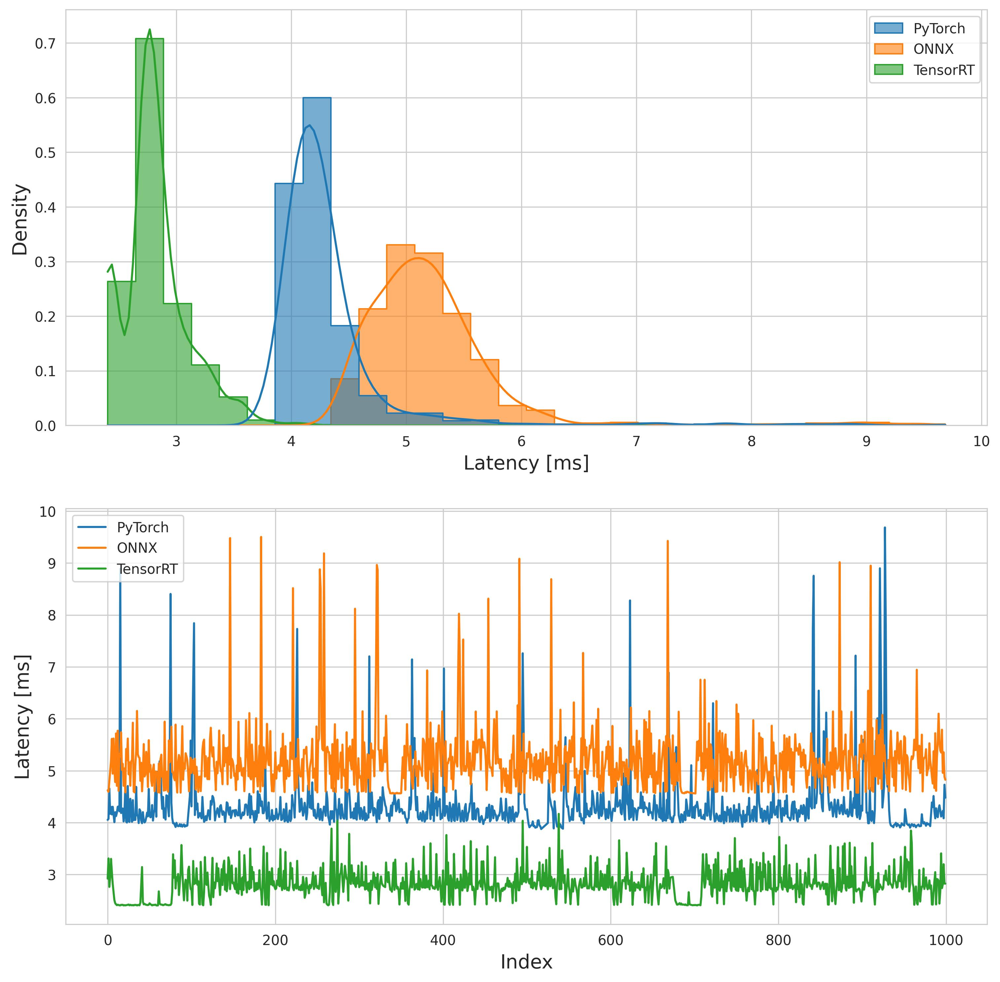
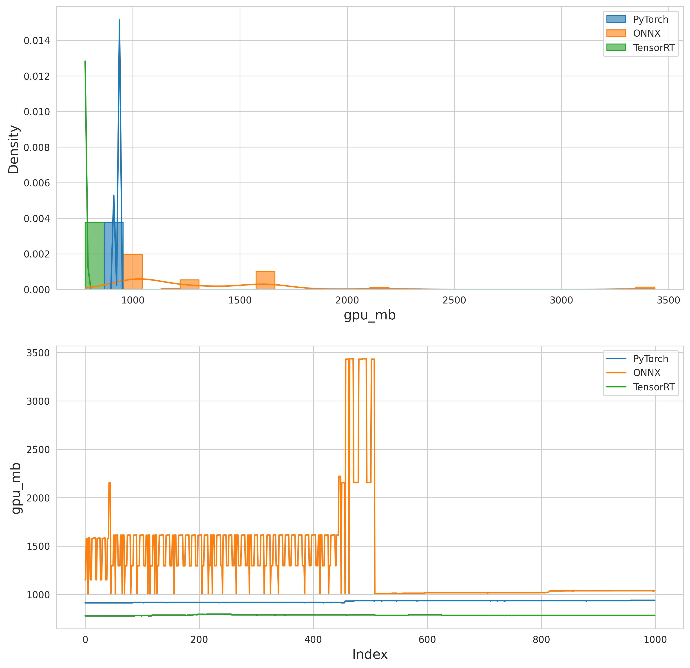
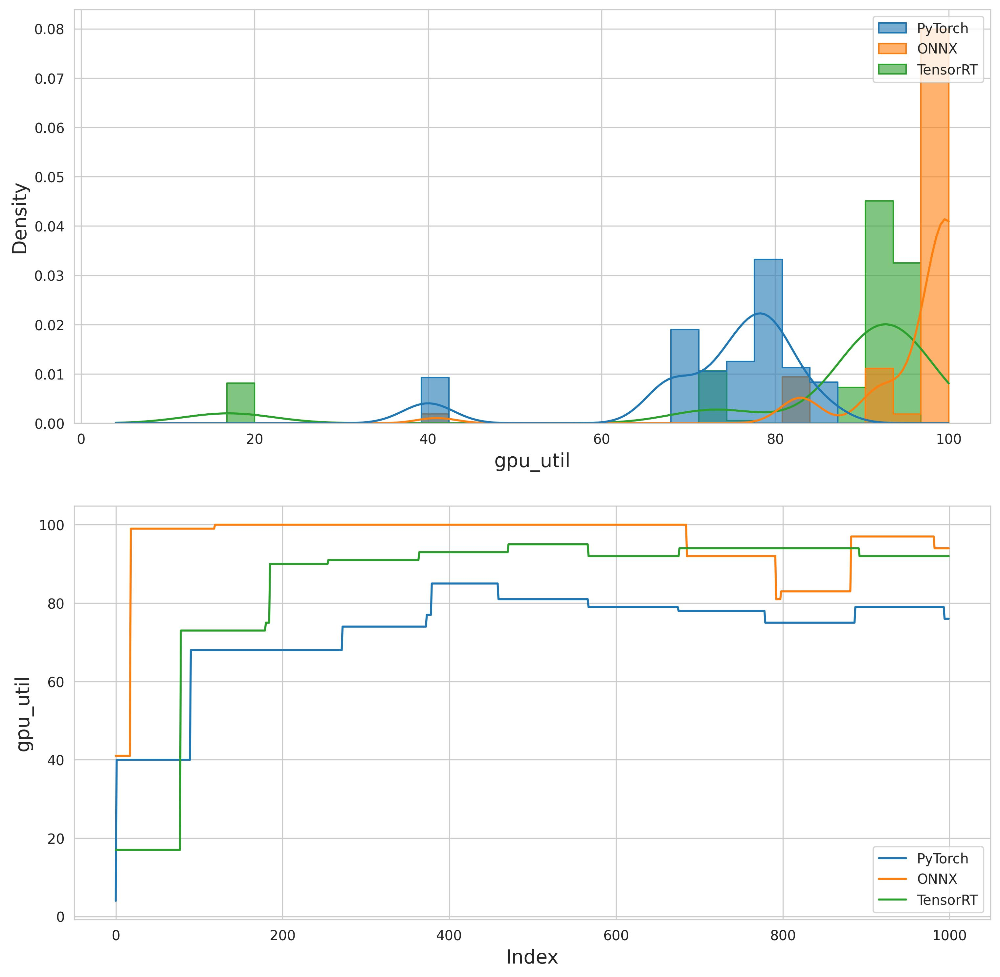
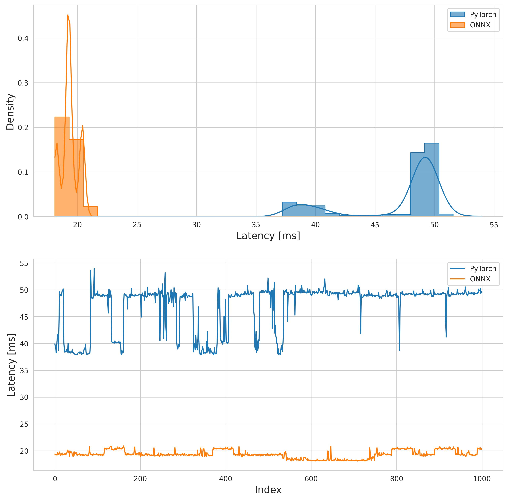

# PyTorch - ONNX - TensorRT inference comparison
Inference time comparison between **`PyTorch`**, **`ONNX`** and **`TensorRT`** engines

# Latency and Memory comparison
Run 
```bash
make measurements
```
to compare the inference times and memory usage of default model (*resnet152* loaded from torchvision) for all engines and devices.

# Model config
Model config is used to parse model from `PyTorch` to `ONNX` and from `ONNX` to `TensorRRT`
```yaml
name: Name of the model used to define model names during files handling
inputs: # list of input definitions
  - name: Name of the input 
    dtype_str: Data type (string representation) of the input, eg. float32
    shapes: # Input shape information
      dims_names: Name for each dim, eg. [batch, C, H, W]
      example: Dimensions of example input (before preprocessing) used for tests, eg. [224, 224, 3]
      runtime: Runtime dimensions (use -1 for dynamic dim), eg. [1, 3, -1, -1]
      optimization: # Dimensions used in TensorRT profiling
        min: Minimum dimensions, eg. [1, 3, 128, 128]
        opt: Optimum dimensions, eg. [1, 3, 256, 256]
        max: Maximum dimensions, eg. [1, 3, 512, 512]
outputs: # list of output definitions
  - name: Name of the output
    shape: # Output shape information
      runtime: Runtime dimensions, eg. [1, 1000]
      dims_names: Name for each dim, eg. [batch, probs]
```

# Example

Model config:
```yaml
name: resnet152
inputs:
  - name: image
    dtype_str: float32
    shapes:
      dims_names: [batch_size, channels, height, width]
      example: [224, 224, 3]
      runtime: [1, 3, -1, -1]
      optimization:
        min: [1, 3, 128, 128]
        opt: [1, 3, 256, 256]
        max: [1, 3, 512, 512]
outputs:
  - name: probs
    shape:
      runtime: [1, 1000]
      dims_names: [batch_size, probs]
```

## CUDA

### Latency


### GPU Memory (VRAM) [mb] 


### GPU utilisation [%] 


## CPU

### Latency
